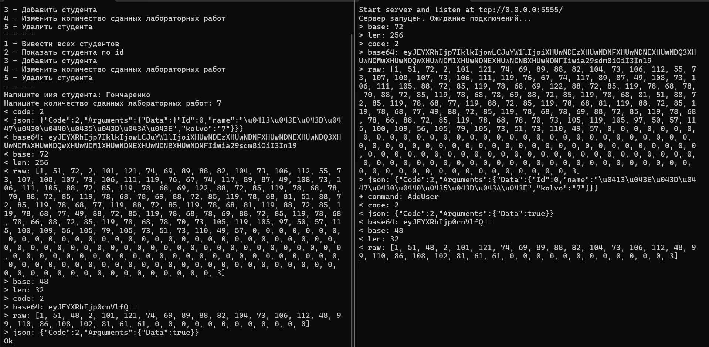
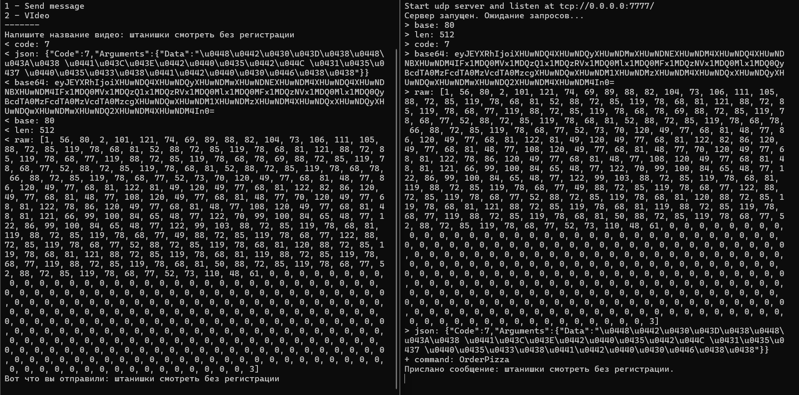

# Lab5.Network Application

## Описание проекта

Этот проект представляет собой клиент-серверное приложение, использующее протоколы TCP и UDP. Главная задача заключается в управлении списком пользователей и обмене сообщениями.

▎Структура кода

▎Основные классы

▎UserApiClient

Обеспечивает взаимодействие с сервером для управления пользователями через TCP:

• AddAsync(User newUser) - добавляет нового пользователя в систему.

• DeleteAsync(int id) - удаляет пользователя по указанному ID.

• GetAllAsync() - возвращает полный список всех пользователей.

• GetAsync(int id) - извлекает информацию о пользователе по его ID.

• UpdateAsync(int id, User updateUser) - обновляет информацию о пользователе.

#### `MessageApiClient`
Реализует взаимодействие с сервером для работы с сообщениями через UDP:
- `SendMessage(string message)` - отправляет сообщение.
- `OrderVideo(string pizzaType)` - отправляет заказ видео.

#### `MessageUdpServer`
Обрабатывает команды, поступающие от UDP клиентов:
- `SendMessage(string message)` - обработка отправки сообщений.
- `OrderVideo(string pizzaType)` - обработка заказа видео.

### Основные файлы
- **`UserApiClient.cs`** - реализация TCP клиента для управления пользователями.
- **`MessageApiClient.cs`** - реализация UDP клиента для отправки сообщений.
- **`MessageUdpServer.cs`** - реализация сервера для обработки UDP команд.
- **`Program.cs`** - точка входа в приложение.

## Установка и запуск

### Требования
- .NET 6.0 или выше.
- Visual Studio 2022 или любая другая IDE, поддерживающая .NET.

### Установка
1. Клонируйте репозиторий:
2. Откройте проект в Visual Studio 2022.
3. Постройте решение (`Build Solution`).

### Запуск
1. Запустите сервер:
   - Перейдите в проект с сервером (например, `Lab5.Network.Server`).
   - Выполните запуск сервера.
2. Запустите клиент:
   - Перейдите в проект с клиентом (например, `Lab5.Network.Client`).
   - Выполните запуск клиента.

## Работа программы

