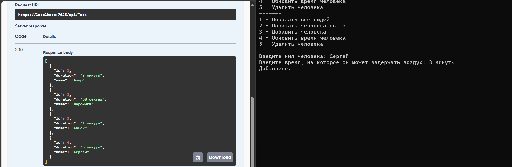

Этот код представляет собой клиент-серверное приложение для управления данными о людях и времени, на которое они могут задерживать дыхание. Вот объяснение по частям:

---

### 1. **Класс `TaskItem`**
Класс `TaskItem` представляет сущность человека, который может задерживать дыхание:
- Свойства:
  - `Id`: уникальный идентификатор.
  - `Name`: имя человека.
  - `Duration`: время, на которое человек может задерживать дыхание.
- Конструкторы позволяют создавать объекты с заданными или пустыми значениями.

---

### 2. **Класс `TaskApiClient`**
`TaskApiClient` реализует интерфейс `ITaskApi` и представляет клиента для взаимодействия с веб-сервером:
- Методы используют `HttpClient` для отправки HTTP-запросов на сервер:
  - `AddAsync`: добавляет нового человека.
  - `DeleteAsync`: удаляет человека по его ID.
  - `GetAllAsync`: получает всех людей.
  - `GetAsync`: получает данные о человеке по ID.
  - `UpdateAsync`: обновляет данные о человеке.

---

### 3. **Главная программа (`Program`)**
#### Основные элементы:
- Настройка HTTP-клиента для взаимодействия с сервером.
- Метод `ManageTasks` реализует консольное меню для взаимодействия с пользователем:
  - **1:** Отображение всех людей в формате таблицы.
  - **2:** Поиск человека по ID.
  - **3:** Добавление нового человека (ввод имени и времени).
  - **4:** Обновление времени задержки дыхания у человека по ID.
  - **5:** Удаление человека по ID.
  - **Escape:** Выход из программы.

#### `PrintMenu`:
Метод отображает доступные действия в консоли.

---

### 4. **Серверная часть**
Серверное приложение, использующее ASP.NET Core:
- **Настройка зависимостей:** Регистрация сервисов, включая сериализацию данных (`IDataSerializer`) и хранилище задач (`ITaskApi`).
- **Swagger:** Включает документацию API.
- **Контроллеры:** Карта маршрутов API для обработки запросов.

---

### 5. **Работа программы**
1. **Клиентская часть:**
   - Пользователь взаимодействует с консольным приложением, которое вызывает методы API через `TaskApiClient`.
2. **Серверная часть:**
   - Обрабатывает HTTP-запросы от клиента.
   - Управляет сохранением, обновлением, удалением и получением данных о людях.

---

### 6. **Пример сценария**
1. Пользователь запускает приложение и выбирает действие из меню.
2. Например, при выборе **3 (Добавить человека):**
   - Программа запрашивает имя и время.
   - Создает объект `TaskItem` и вызывает метод `AddAsync` клиента.
   - Клиент отправляет POST-запрос на сервер, который сохраняет данные.
3. Пользователь может проверить результат, выбрав **1 (Показать всех людей).**

---

Этот код демонстрирует реализацию простого RESTful API с клиентской частью на C# и серверной частью на ASP.NET Core.

### Работа программы
